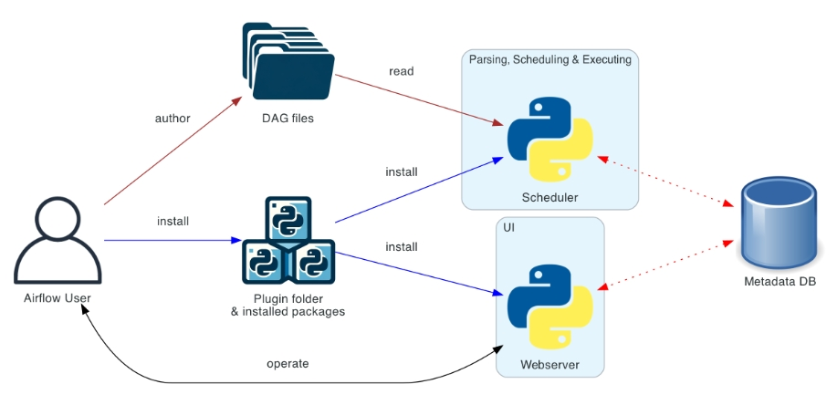

  <h1 align="center">Airflow工作流平台</h1>
  

    <a href="README.md"><strong>English</strong></a> | <strong>简体中文</strong>
  

## 目录

- [仓库简介](#项目介绍)
- [前置条件](#前置条件)
- [镜像说明](#镜像说明)
- [获取帮助](#获取帮助)
- [如何贡献](#如何贡献)

## 项目介绍
‌[Apache Airflow‌](https://github.com/apache/Airflow) 是一个用于编排、调度和监控工作流的平台。它允许用户以编程的方式定义复杂的工作流，这些工作流可以包含多个任务，并且这些任务之间可以有依赖关系。工作流在 Airflow 中被定义为有向无环图（DAG，Directed Acyclic Graph）。DAG 由一系列的任务（Task）组成，任务之间通过定义好的依赖关系连接起来。

**核心特性：**
1. 动态性：流水线在代码中定义，可以动态生成 DAG 并进行参数化。
2. 可扩展性：Airflow 框架包含广泛的内置 operators，并且可以根据您的需求进行扩展。
3. 灵活性：Airflow 利用 Jinja 模板引擎，允许进行丰富的自定义。 

**架构设计：**

本项目提供的开源镜像商品 [**Airflow工作流平台**](https://marketplace.huaweicloud.com/contents/1fe654fa-4bc6-4386-90de-f27961f5f8cc#productid=OFFI1137281827882840064)，已预先安装 Airflow 软件及其相关运行环境，并提供部署模板。快来参照使用指南，轻松开启“开箱即用”的高效体验吧。

> **系统要求如下：**
> - CPU: 2GHz 或更高
> - RAM: 4GB 或更大
> - Disk: 至少 40GB

## 前置条件
[注册华为账号并开通华为云](https://support.huaweicloud.com/usermanual-account/account_id_001.html)

## 镜像说明

| 镜像规格                                                                                                                                 | 特性说明                                      | 备注 |
|--------------------------------------------------------------------------------------------------------------------------------------|-------------------------------------------| --- |
| [Airflow2.1-kunpeng-v1.0](https://github.com/HuaweiCloudDeveloper/airflow-image/tree/Airflow2.1-kunpeng-v1.0) | 基于 鲲鹏服务器 + Huawei Cloud EulerOS 2.0 64bit 安装部署 |  |
| [Airflow2.1-kunpeng-v1.0](https://github.com/HuaweiCloudDeveloper/airflow-image/tree/Airflow2.1-kunpeng-v1.0) | 基于 鲲鹏服务器 + Ubuntu24.04 64bit 安装部署         |  |

## 获取帮助
- 更多问题可通过 [issue](https://github.com/HuaweiCloudDeveloper/airflow-image/issues) 或 华为云云商店指定商品的服务支持 与我们取得联系
- 其他开源镜像可看 [open-source-image-repos](https://github.com/HuaweiCloudDeveloper/open-source-image-repos)

## 如何贡献
- Fork 此存储库并提交合并请求
- 基于您的开源镜像信息同步更新 README.md
