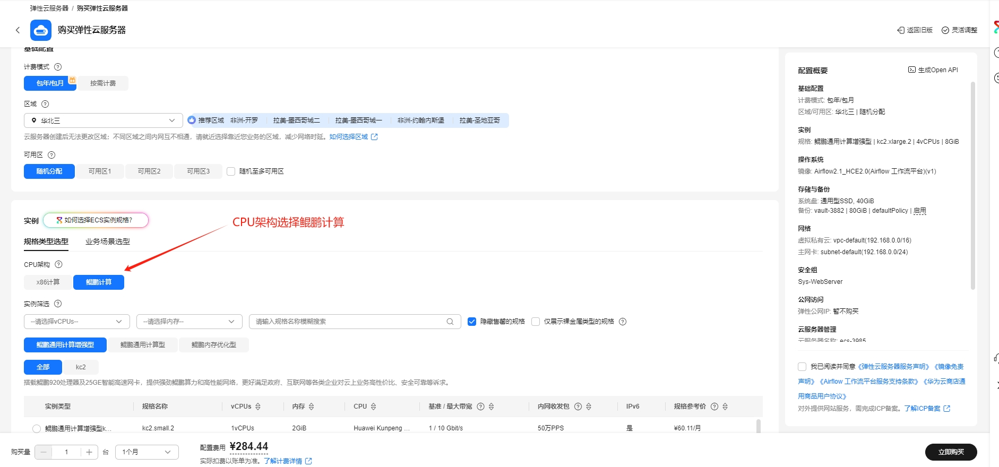
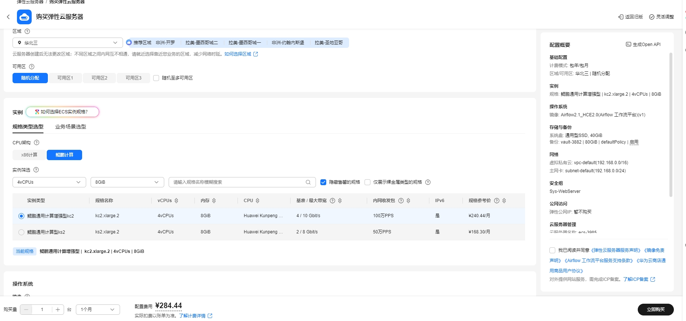
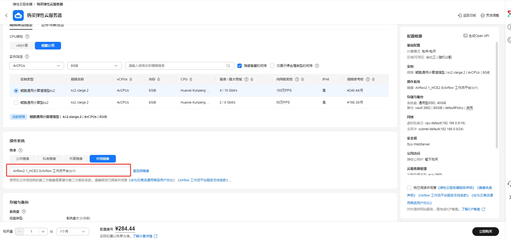
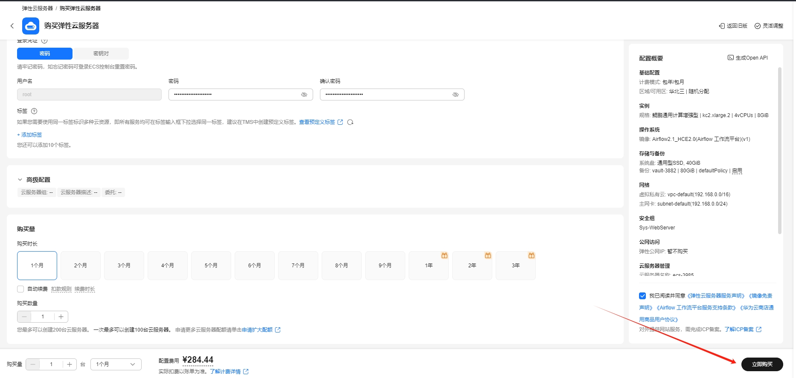

# Airflow工作流平台使用指南

# 一、商品链接

[Airflow工作流平台](https://marketplace.huaweicloud.com/hidden/contents/1fe654fa-4bc6-4386-90de-f27961f5f8cc#productid=OFFI1137281825272061952)

# 二、商品说明

**Apache Airflow** 是一个用于编排、调度和监控工作流的平台。它允许用户以编程的方式定义复杂的工作流，这些工作流可以包含多个任务，并且这些任务之间可以有依赖关系。工作流在 Airflow 中被定义为有向无环图（DAG，Directed Acyclic Graph）。DAG 由一系列的任务（Task）组成，任务之间通过定义好的依赖关系连接起来。
# 三、商品购买

您可以在云商店搜索 **Airflow工作流平台**。

其中，地域、规格、推荐配置使用默认，购买方式根据您的需求选择按需/按月/按年，短期使用推荐按需，长期使用推荐按月/按年，确认配置后点击“立即购买”。

## 3.1 使用 RFS 模板直接部署

必填项填写后，点击 下一步

创建直接计划后，点击 确定

点击部署，执行计划

如下图“Apply required resource success. ”即为资源创建完成

##  3.2 ECS 控制台配置

### 准备工作

在使用ECS控制台配置前，需要您提前配置好 **安全组规则**。

> **安全组规则的配置如下：**
> - 入方向规则放通端口8080，源地址内必须包含您的客户端ip，否则无法访问
> - 入方向规则放通 CloudShell 连接实例使用的端口 `22`，以便在控制台登录调试
> - 出方向规则一键放通

### 创建ECS

前提工作准备好后，选择 ECS 控制台配置跳转到[购买ECS](https://support.huaweicloud.com/qs-ecs/ecs_01_0103.html) 页面，ECS 资源的配置如下图所示：

选择CPU架构

选择服务器规格

选择镜像

其他参数根据实际请客进行填写，填写完成之后，点击立即购买即可

> **值得注意的是：**
> - VPC 您可以自行创建
> - 安全组选择 [**准备工作**](#准备工作) 中配置的安全组；
> - 弹性公网IP选择现在购买，推荐选择“按流量计费”，带宽大小可设置为5Mbit/s；
> - 高级配置需要在高级选项支持注入自定义数据，所以登录凭证不能选择“密码”，选择创建后设置；
> - 其余默认或按规则填写即可。

# 四、商品使用

## 修改 /etc/hosts 域名
将 192.168.0.24 hadoop1 --> *.*.*.* hadoop1

## 命令行进入 conda 虚拟环境
conda activate python39

## 启动 web 程序
airflow webserver --port 8080 -D

## 启动 scheduler 调度程序
airflow scheduler -D

## 浏览 web ui
ip:8080

## 用户及密码
airflow/123456

## 参考文档
[Airflow官网](https://airflow.apache.org/)
